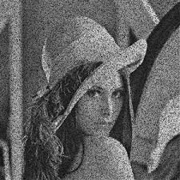

# Задание
### Фильтрация шума "Соль и перец"
**Язык:** C++ или Python  
**Входные данные:** изображение  
**Выходные данные:** изображения, к которым применен медианный фильтр на GPU, отчет о результатах

# Описание
Данная лабораторная работа была выполнена на языке Python в Jupyter Notebook.

В ней реализуется применение медианного фильтра на изображении с GPU через библиотеку CUDA.

**Определение ядра CUDA:**
1) Функция `mf_kernel`, которая будет выполняться на GPU, реализует медианный фильтр с использованием 9-точечного окна (3x3).
2) В начале функции определяется позиция потока в сетке с помощью `cuda.grid(2)`, что позволяет каждому потоку обрабатывать отдельный пиксель изображения.
3) Функция пропускает обработку пикселей на границах изображения (поскольку для них нельзя применить 3x3 фильтр).
4) Затем создается локальный массив `window`, который хранит значения 9 пикселей из 3x3 области вокруг текущего пикселя.
5) После этого выполняется пузырьковая сортировка для нахождения медианного значения из 9 пикселей.
6) Наконец, медианное значение присваивается соответствующему пикселю в выходном изображении.

**Медианный фильтр:**
1) Функция `mf_gpu(input_image)` принимает входное изображение и применяет к нему медианный фильтр, используя CUDA.
2) Изображение преобразуется в формат float32 для совместимости.
3) Получаются размеры изображения (ширина и высота).
4) Создается пустой массив для выходного изображения.
5) Данные входного и выходного изображений копируются на GPU.
6) Определяются размеры блоков и сетки для запуска ядра CUDA.
7) Запускается ядро `mf_kernel` с заданными размерами блоков и сетки.
8) Результат копируется обратно с GPU на CPU и возвращается.

**Загрузка и обработка изображения:**  
1) Загружается исходное изображение в градациях серого из файла `sapimg.jpg` с помощью OpenCV.
2) Измеряется время, затраченное на выполнение медианного фильтра на GPU.
3) Выводится время выполнения.

**Загрузка и обработка изображения:**
1) Исходное изображение и обработанное (с медианным фильтром) отображаются с помощью PIL.
2) Выходное изображение преобразуется в формат uint8, чтобы корректно отображаться.

Таким образом, эта лабораторная работа демонстрирует, как можно использовать GPU для ускорения обработки изображений с помощью медианного фильтра, что позволяет эффективно удалять шум и улучшать качество изображения.

# Анализ результатов
Ниже представлены результаты измерений времени выполнения кода на GPU для двух изображений и, непосредственно, исходные изображения и изображения с примененным медианным фильтром.

Время на GPU:  0.677687  
Первое исходное изображение:  
  
Первое изображение с примененным медианным фильтром:  
  

Время на GPU:  0.004865  
Второе исходное изображение:  
  
Второе изображение с примененным медианным фильтром:  
  
